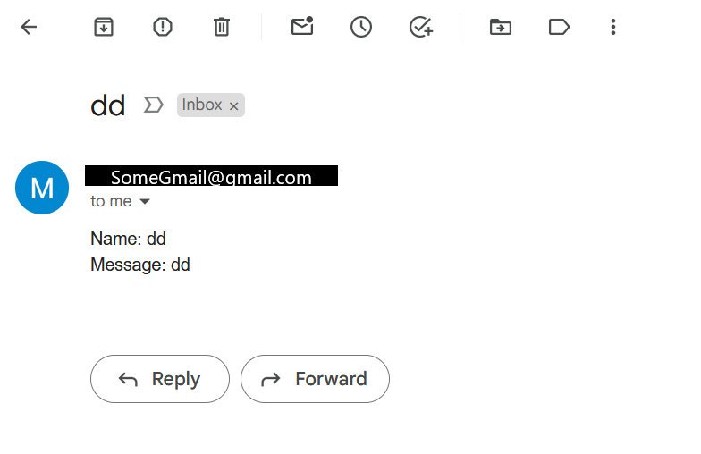
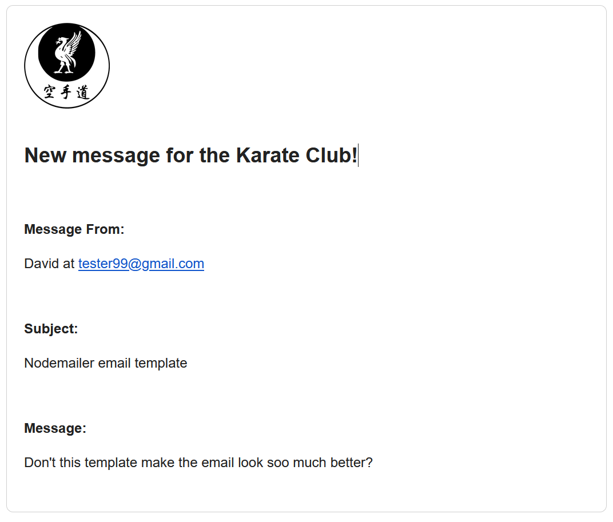

# Introduction

Recently, I found myself tasked with creating a contact form that would send emails to the website owner's Gmail account. After a multi-hour journey, I was thrilled when I finally witnessed the end result landing in my test inbox – just three plain lines of text: <b>Name</b>, <b>Subject</b>, and <b>Message</b>.

<figure> 
 
<figcaption class="text-secondary">Example of comprehensive testing with "dd"</figcaption>
</figure>

As my excitement grew, I delved into the world of email customization, specifically focusing on styling Nodemailer-generated emails. Initially, I contemplated leaving those three simple lines of text as they were, but after three days of intensive exploration, I now understand why "<b>Email templater</b>" deserves to be a dedicated job title.

In this guide, I will walk you through the process of using JavaScript to set up Nodemailer mail options, demonstrate how to display the sender's email and enable reply functionality in Gmail, and even show you how to create a basic HTML email template complete with an embedded image!

    
Please note that I won't cover the setup of Nodemailer authentication or email sending error handling in this post, as they extend beyond its intended scope. However, if you're looking for more on these topics, I've discovered a fantastic example on the <a href="https://miracleio.templateme/snippets/use-gmail-with-nodemailer"><b>Miracleio blog</b></a> that you can explore.

# Before we start

Before we dive into the process, it's essential to ensure that IntelliSense in your IDE is configured to provide suggestions for both HTML and CSS when working in .html and .js files. Leveraging IntelliSense suggestions can significantly speed up the process of adding new tags and identifying bugs.

For those who may be unsure about configuring IDE settings, here's a quick tip: consider starting with a new .html file dedicated to your HTML template. Once you've crafted your template, you can easily transfer it to your JavaScript file or export it as a module.

# Setting up Nodemail mailOptions object

In Nodemailer, the mailOptions object can contain a wide range of fields. If you'd like to explore all the available options, you can refer to the <a href="https://nodemailer.com/message/">Nodemailer DOCS </a>

In this example, we will be using the <b>from:, to:, replyTo:, subject:, and html: </b> fields.

Firstly, let's split your email data object into individual variables, which represent the name, email address, email subject, and the message from the sender. The approach to this step varies significantly based on the source of the email variables. This can range from users filling out a form or using hardcoded variables.

Fixed variables:


const name = "Tester";
const email = "Tester@gmail.com";
const subject = "Followed a blog";
const message = "How is my template looking?"; 


Or from a JSON object:


const {name, email, subject, message} = JSON.parse(event.body);


In my case, using a user contact form, the <b>event.body</b> object contains my variables, which I extract using JavaScript object destructuring.

Once we have our individual variables, we can create the Nodemailer <b>mailOptions</b> object, specifying the email sender's name and email address, receiver emails, the <b>replyTo</b> field to populate the correct reply-to field in Gmail, and the email subject.


let mailOptions = {
    from: {
        name: `"${name}" <${email}>`,  
        address: `<${email}>`
    },
    to: `${RECEIVING EMAIL ADDRESS GOES HERE}`,
    replyTo: `${email}`, 
    subject: `${subject}`
// ... Rest code further down the blog ...


For the <b>from:</b> field, I use an <b>address</b> object, with the double <b><$email></b> to override Gmail's header formatting and correctly display the name and address of the sender, like this: <b>Sender_name < tester@gmail.co.uk >.</b> I tried various other combinations, but this one is the only one that worked for me so far.

Next, we add the HTML tag where the email template code goes. You can define the email template in two ways:

Inline html:

html: `<h1>HTML version of the ${message}</h1>`,

Or in an external .js file:

// ... TOP OF THE FILE...
 const { html_template }  = require('./mailTemplate');
// ... Inside mailOptions... 
  html: html_template(name,email,subject,message),


The inline method is more straightforward, but the HTML code can quickly become long and unwieldy. It's worth the effort to create the template in a separate file, like <b>emailTemplate.js</b>, with a <b>html_template</b> function.

The most challenging part about module exports is configuring your website environment to handle module exports. In my case, using Eleventy, my <b>emailTemplate.js</b> looks like this:


module.exports = {
  html_template: (name,email,subject,message) => {
  return ` 
    // ... HTML CODE ... 
  `;
  }
};


Notice how we use <b>template literals</b> to surround the HTML code, allowing us to insert arguments such as name and email directly into the HTML using <b>${name}</b>.

Finally, let's discuss the attachment tags, which we use to attach and display an image within the email template.


     attachments: [{
        filename: 'yourimagename.png',
        path: process.cwd() + '/images/yourimagename.png',
        cid: 'logo1' //same cid value as in the html img src
}]
    };


This can be a bit tricky to get working because the attachment tag requires the <b>absolute directory path</b> of the image:


 path: process.cwd() + '/images/yourimagename.png',


I used <b>'process.cwd()'</b> and <b>'/images'</b> because my images are located one folder deep from the root directory of the website folder.

Your image path should look like this: <b>'C:\Users\yourusername\Big Projects\yourwebsite\images\yourimagename.png'</b>.


filename: 'yourimagename.png',


Make sure the <b>filename</b> tag matches the filename in the path. One more tip, I tried sending a .svg image, but this did not work on Gmail, so stick to .png or .jpg for this example.

Finally, to use the attached image within the HTML email template, we use the <b>cid:</b> tag.


cid: 'logo1'

We will use <b>cid:logo1</b> in our HTML template instead of the usual src with a path or URL.




# Email template and Internal styling

Before we make an email look pretty, here are some things I've learned about email templates.

<b>First</b>, an email template must act as a fully self-contained HTML page from the doctype declaration to the HTML closing tag.

<b>Second</b>, if you want to add CSS styles, be prepared – all CSS styling <b>must be either internal or inline</b>.

<b>Third</b>, due to minimal or random HTML and CSS support by email clients, it's best not to use recent CSS features like flex or grid, as they have a high chance of not working. Outlook being one of the major culprits.

In the HTML file, let's start with the basic DOCTYPE and HEAD declaration.


<!doctype html>
<html>
  <head>
    <meta name="viewport" content="width=device-width, initial-scale=1.0">
    <meta http-equiv="Content-Type" content="text/html; charset=UTF-8">
    <title>Simple Email Template</title>
             


Feel free to add other CSS classes to further customize the email template once you have the basic template working.

# The template "BODY"

Start by declaring the body tag with inline styles that affect the whole template, such as setting the full email window background color, font-family and minimum font size.


 <body style="background-color: white; font-family: Helvetica,Arial,sans-serif; font-size: 16px; width: 100% !important; margin: 0 !important; padding: 0; line-height: 1.5;">


Now, we add the table, which acts as the main container to hold and provide structure to all other HTML elements.


 <table class="container" cellspacing="0" cellpadding="0" border="0">
    <tr>
        <td>  </td>
    </tr>
    <tr>
        <td class="row">
         <h2 class="header">New message for the Karate Club!</h2>
        </td>
    </tr>
    <tr>
        <td class="row">
         
Message From:

         
${name} at ${email}
 
        </td>
    </tr>
    <tr>
        <td class="row">
         
Subject:

         
${subject}

        </td>
    </tr>
    <tr>
        <td class="row">
         
Message:

         
${message}

        </td>
    </tr>
 </table>
</body>
</html>
`;  


We also use JavaScript inside HTML using <b>${}</b> to insert variables such as email subject and message directly into the template.

This works for both inline and external email templates; just make sure to keep the variable names consistent and correctly spelled. Don't ask me how I know.

# Final Result

And finally, close out the body, HTML, and don't forget the <b>``</b> tags to complete the template.

The final result should look something like this in Gmail.

 
<figure>

<figcaption class="text-secondary">Completed email template from a previews project</figcaption>
</figure> 

From here, you can modify the template by adjusting the inline CSS and altering the layout, either by adding more table rows or by taking inspiration from other template designs available on GitHub.

Email templating swiftly becomes a distinct task due to the intricate requirements of table layouts and inline styles essential for achieving a stylish and compatible appearance across all email clients.

When you dive into email templating, you're essentially taking a delightful journey back to the early 2000s web design. Hope you found this guide helpful on your journey to fill inboxes around the world with style!

## Common Errors

    
<b>Here is the list of most common errors, all of which I tested myself!</b>

    <ul>
        <li>Missing or incorrect template literals, e.g., <b>''</b> instead of <b>``</b>. </li>
        <li>Not matching files names for html template module, imagefile, image path </li>
        <li>Forgetting the comma <b>","</b> after each file inside mailOptions</li>
        <li>Using .svg images instead of .png in attachments</li>
        <li>Not importing external modules at the top of js file</li>
        <li>Incorrectly module setup in package.json - either modole.export or export default</li>
    </ul>

